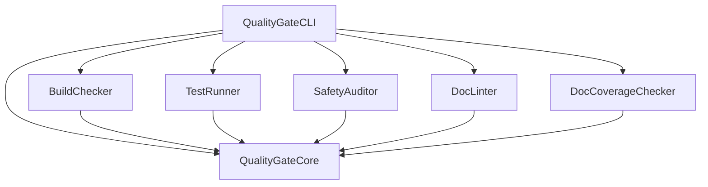

# quality-gate-swift Master Plan

**Purpose:** Source of truth for project vision, architecture, and goals.

---

## Project Overview

### Mission
Provide a production-quality Swift CLI tool that automates Zero Warnings/Errors quality gates for Swift projects, with structured output for CI/CD integration and SPM plugin support.

### Target Users
- **Swift Developers** — Run quality checks locally before committing
- **CI/CD Pipelines** — Automated quality gates with JSON/SARIF output
- **AI-Assisted Development** — MCP-ready tool descriptions for AI agents

### Key Differentiators
- **Plugin-based architecture** — Each checker is modular and independently testable
- **Multiple output formats** — Terminal, JSON, and SARIF for GitHub Code Scanning
- **SPM Integration** — Both CommandPlugin and BuildToolPlugin support
- **Configuration via YAML** — Project-specific settings via `.quality-gate.yml`
- **Absorbs existing tools** — docc-lint and swift-doc-gaps capabilities built-in

---

## Architecture

### Technology Stack
- **Language:** Swift 6.2 (strict concurrency enforced)
- **Frameworks:** swift-argument-parser, Yams, SwiftSyntax
- **Build System:** Swift Package Manager
- **Testing:** Swift Testing framework

### Module Structure

```
quality-gate-swift/
├── Sources/
│   ├── QualityGateCore/          # Shared protocol, models, reporters
│   ├── SafetyAuditor/            # Code safety + OWASP security scanning
│   ├── BuildChecker/             # swift build wrapper
│   ├── TestRunner/               # swift test wrapper
│   ├── DocLinter/                # Documentation linter
│   ├── DocCoverageChecker/       # Undocumented API detector (SwiftSyntax)
│   ├── RecursionAuditor/         # Call-graph cycle detection
│   ├── ConcurrencyAuditor/       # Swift 6 concurrency compliance
│   ├── PointerEscapeAuditor/     # Unsafe pointer lifetime tracking
│   ├── UnreachableCodeAuditor/   # Dead code via SwiftSyntax + IndexStore
│   ├── AccessibilityAuditor/     # SwiftUI accessibility checks
│   ├── LoggingAuditor/           # print() ban, silent-try audit, os.Logger check
│   ├── TestQualityAuditor/       # Assertion quality, determinism, float equality
│   ├── ContextAuditor/           # Ethical context: consent, analytics, surveillance
│   ├── SwiftVersionChecker/      # swift-tools-version compliance
│   ├── StatusAuditor/            # Doc drift detection + remediation
│   ├── MemoryBuilder/            # Project memory generation + validation
│   ├── DiskCleaner/              # Build artifact identification
│   └── QualityGateCLI/           # Umbrella CLI (--fix, --dry-run, --bootstrap)
├── Tests/
│   └── [Test targets for each module — 614 tests, 72 suites]
└── Package.swift
```

### Key Types

| Type | Purpose |
|------|---------|
| `QualityChecker` | Protocol all checkers implement |
| `CheckResult` | Result of a single quality check |
| `Diagnostic` | Individual issue found during checking |
| `Configuration` | Project-specific settings from YAML |
| `Reporter` | Protocol for output formatting |

### Module Dependency Graph



---

## Current Status

### What's Working
- [x] QualityGateCore — Protocol, models, reporters, configuration (63 tests)
- [x] SafetyAuditor — Code safety (9 rules) + OWASP security (10 rules), 83 tests
- [x] BuildChecker — swift build wrapper with output parsing
- [x] TestRunner — swift test wrapper with Swift Testing + XCTest parsing
- [x] DocLinter — DocC documentation validation
- [x] DocCoverageChecker — SwiftSyntax-based undocumented API detection
- [x] RecursionAuditor — Call-graph cycle detection, mutual recursion
- [x] ConcurrencyAuditor — Swift 6 strict concurrency compliance
- [x] PointerEscapeAuditor — Unsafe pointer lifetime tracking
- [x] UnreachableCodeAuditor — Dead code via SwiftSyntax + IndexStore
- [x] AccessibilityAuditor — SwiftUI accessibility checks
- [x] MemoryBuilder — Project memory file generation + post-extraction validation
- [x] StatusAuditor — Doc drift detection + FixableChecker remediation (49 tests)
- [x] LoggingAuditor — print() ban, silent-try audit, os.Logger import check
- [x] TestQualityAuditor — Assertion quality, determinism, float equality enforcement
- [x] ContextAuditor — Ethical context: consent guards, analytics opt-out, surveillance disclosure (advisory)
- [x] SwiftVersionChecker — swift-tools-version minimum compliance
- [x] DiskCleaner — Build artifact identification
- [x] QualityGateCLI — Umbrella CLI with all checkers, --fix/--dry-run/--bootstrap flags
- [x] QualityGatePlugin — SPM CommandPlugin

**Total: 614 tests across 72 suites**

### Known Issues
- None currently

### Current Priorities
1. Complete DocC catalogs for AccessibilityAuditor, DiskCleaner, MemoryBuilder, StatusAuditor, QualityGateCLI
2. Security rule maintenance — WWDC annual review cycle
3. Community engagement — swift-security-rules Semgrep YAML repo

---

## Error Registry (SSoT)

**All custom error cases must be registered here before implementation.**

| Error Case | Module | Description | Added |
|------------|--------|-------------|-------|
| `QualityGateError.buildFailed` | Core | Swift build exited with non-zero status | v1.0 |
| `QualityGateError.testsFailed` | Core | One or more tests failed | v1.0 |
| `QualityGateError.safetyViolation` | Core | Forbidden pattern detected | v1.0 |
| `QualityGateError.docLintFailed` | Core | Documentation has issues | v1.0 |
| `QualityGateError.configurationError` | Core | Invalid YAML configuration | v1.0 |
| `QualityGateError.processTimeout` | Core | External command timed out | v1.0 |

---

## Quality Standards

### Code Quality
- All code follows `01_CODING_RULES.md`
- Test coverage target: 80%+
- Documentation for all public APIs
- No warnings in build output
- Swift 6 strict concurrency compliance

### Documentation Quality
- DocC comments for all public functions
- Usage examples in documentation
- MCP schemas for AI consumption

---

## Roadmap

### Phase 1: Foundation (COMPLETE)
- [x] QualityGateCore module with tests
- [x] DocC documentation for Core
- [x] SafetyAuditor implementation

### Phase 2: Checker Modules (COMPLETE)
- [x] BuildChecker implementation
- [x] TestRunner implementation
- [x] DocLinter implementation (port docc-lint)
- [x] DocCoverageChecker implementation (port swift-doc-gaps)
- [x] RecursionAuditor — call-graph analysis, mutual recursion
- [x] ConcurrencyAuditor — Swift 6 strict concurrency
- [x] PointerEscapeAuditor — unsafe pointer lifetime
- [x] UnreachableCodeAuditor — dead code via IndexStore
- [x] AccessibilityAuditor — SwiftUI accessibility
- [x] SecurityVisitor — 10 OWASP Mobile Top 10 rules (within SafetyAuditor)
- [x] LoggingAuditor — print() ban, silent-try detection, os.Logger enforcement
- [x] TestQualityAuditor — Assertion quality, determinism, float equality
- [x] ContextAuditor — Ethical context checker (consent, analytics, surveillance, automated decisions)
- [x] SwiftVersionChecker — swift-tools-version minimum compliance

### Phase 3: CLI & Integration (COMPLETE)
- [x] Umbrella CLI implementation
- [x] SPM CommandPlugin
- [ ] SPM BuildToolPlugin
- [x] YAML configuration support
- [x] CI workflow (build, test, memory validation)
- [x] Security rule staleness workflow (bi-monthly cron)
- [x] StatusAuditor — doc drift detection with 8 diagnostic rules
- [x] FixableChecker protocol — --fix/--dry-run/--bootstrap CLI flags
- [x] MemoryBuilder validation pass — broken index links, malformed/empty files

### Phase 4: Community & Polish (CURRENT)
- [ ] DocC catalogs for remaining modules
- [x] CONTRIBUTING.md and community guidelines
- [ ] GitHub Action for easy CI integration
- [ ] VS Code extension integration
- [ ] Xcode integration via Build Phases

---

**Last Updated:** 2026-04-29
