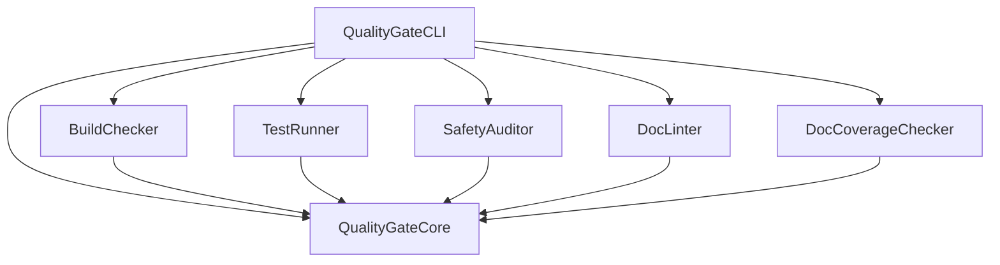

# quality-gate-swift Master Plan

**Purpose:** Source of truth for project vision, architecture, and goals.

---

## Project Overview

### Mission
Provide a production-quality Swift CLI tool that automates Zero Warnings/Errors quality gates for Swift projects, with structured output for CI/CD integration and SPM plugin support.

### Target Users
- **Swift Developers** — Run quality checks locally before committing
- **CI/CD Pipelines** — Automated quality gates with JSON/SARIF output
- **AI-Assisted Development** — MCP-ready tool descriptions for AI agents

### Key Differentiators
- **Plugin-based architecture** — Each checker is modular and independently testable
- **Multiple output formats** — Terminal, JSON, and SARIF for GitHub Code Scanning
- **SPM Integration** — Both CommandPlugin and BuildToolPlugin support
- **Configuration via YAML** — Project-specific settings via `.quality-gate.yml`
- **Absorbs existing tools** — docc-lint and swift-doc-gaps capabilities built-in

---

## Architecture

### Technology Stack
- **Language:** Swift 6.0 (strict concurrency enforced)
- **Frameworks:** swift-argument-parser, Yams, SwiftSyntax
- **Build System:** Swift Package Manager
- **Testing:** Swift Testing framework

### Module Structure

```
quality-gate-swift/
├── Sources/
│   ├── QualityGateCore/          # Shared protocol and models
│   │   ├── Diagnostic.swift
│   │   ├── CheckResult.swift
│   │   ├── Configuration.swift
│   │   ├── QualityChecker.swift
│   │   ├── QualityGateError.swift
│   │   └── Reporters/
│   │       ├── Reporter.swift
│   │       ├── TerminalReporter.swift
│   │       ├── JSONReporter.swift
│   │       └── SARIFReporter.swift
│   ├── SafetyAuditor/            # Forbidden pattern scanner
│   ├── BuildChecker/             # swift build wrapper
│   ├── TestRunner/               # swift test wrapper
│   ├── DocLinter/                # Documentation linter
│   ├── DocCoverageChecker/       # Undocumented API detector
│   └── QualityGateCLI/           # Umbrella CLI
├── Tests/
│   └── [Test targets for each module]
└── Package.swift
```

### Key Types

| Type | Purpose |
|------|---------|
| `QualityChecker` | Protocol all checkers implement |
| `CheckResult` | Result of a single quality check |
| `Diagnostic` | Individual issue found during checking |
| `Configuration` | Project-specific settings from YAML |
| `Reporter` | Protocol for output formatting |

### Module Dependency Graph



---

## Current Status

### What's Working
- [x] QualityGateCore — Protocol, models, reporters (54 tests)
- [x] All three reporters — Terminal, JSON, SARIF
- [x] Configuration — YAML parsing, defaults
- [ ] SafetyAuditor — Stub only
- [ ] BuildChecker — Stub only
- [ ] TestRunner — Stub only
- [ ] DocLinter — Stub only
- [ ] DocCoverageChecker — Stub only
- [ ] CLI — Stub only

### Known Issues
- None currently

### Current Priorities
1. Complete DocC documentation for QualityGateCore
2. Implement SafetyAuditor (most self-contained)
3. Implement BuildChecker and TestRunner
4. Port docc-lint and swift-doc-gaps capabilities

---

## Error Registry (SSoT)

**All custom error cases must be registered here before implementation.**

| Error Case | Module | Description | Added |
|------------|--------|-------------|-------|
| `QualityGateError.buildFailed` | Core | Swift build exited with non-zero status | v1.0 |
| `QualityGateError.testsFailed` | Core | One or more tests failed | v1.0 |
| `QualityGateError.safetyViolation` | Core | Forbidden pattern detected | v1.0 |
| `QualityGateError.docLintFailed` | Core | Documentation has issues | v1.0 |
| `QualityGateError.configurationError` | Core | Invalid YAML configuration | v1.0 |
| `QualityGateError.processTimeout` | Core | External command timed out | v1.0 |

---

## Quality Standards

### Code Quality
- All code follows `01_CODING_RULES.md`
- Test coverage target: 80%+
- Documentation for all public APIs
- No warnings in build output
- Swift 6 strict concurrency compliance

### Documentation Quality
- DocC comments for all public functions
- Usage examples in documentation
- MCP schemas for AI consumption

---

## Roadmap

### Phase 1: Foundation (CURRENT)
- [x] QualityGateCore module with tests
- [ ] DocC documentation for Core
- [ ] SafetyAuditor implementation

### Phase 2: Checker Modules
- [ ] BuildChecker implementation
- [ ] TestRunner implementation
- [ ] DocLinter implementation (port docc-lint)
- [ ] DocCoverageChecker implementation (port swift-doc-gaps)

### Phase 3: CLI & Integration
- [ ] Umbrella CLI implementation
- [ ] SPM CommandPlugin
- [ ] SPM BuildToolPlugin
- [ ] YAML configuration support

### Future Considerations
- GitHub Action for easy CI integration
- VS Code extension integration
- Xcode integration via Build Phases

---

**Last Updated:** 2026-03-13
