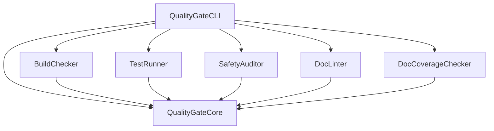

# quality-gate-swift Master Plan

**Purpose:** Source of truth for project vision, architecture, and goals.

---

## Project Overview

### Mission
Provide a production-quality Swift CLI tool that automates Zero Warnings/Errors quality gates for Swift projects, with structured output for CI/CD integration and SPM plugin support.

### Target Users
- **Swift Developers** — Run quality checks locally before committing
- **CI/CD Pipelines** — Automated quality gates with JSON/SARIF output
- **AI-Assisted Development** — MCP-ready tool descriptions for AI agents

### Key Differentiators
- **Plugin-based architecture** — Each checker is modular and independently testable
- **Multiple output formats** — Terminal, JSON, SARIF, and Xcode for inline annotations
- **SPM Integration** — Both CommandPlugin and BuildToolPlugin support
- **Configuration via YAML** — Project-specific settings via `.quality-gate.yml`
- **Absorbs existing tools** — docc-lint and swift-doc-gaps capabilities built-in
- **Institutional Judgment System** — Cross-project quality tracking with Pulse, calibrations, and consistency scoring
- **MCP Server** — AI assistants can query telemetry and record calibrations in real time

---

## Architecture

### Technology Stack
- **Language:** Swift 6.2 (strict concurrency enforced)
- **Frameworks:** swift-argument-parser, Yams, SwiftSyntax, IndexStoreDB, SwiftMCPServer
- **Build System:** Swift Package Manager
- **Testing:** Swift Testing framework
- **Deployment:** Local CLI + roseclub.org (Swift 6.3, macOS x86_64) for MCP server

### Module Structure

```
quality-gate-swift/
├── Sources/
│   ├── QualityGateCore/          # Shared protocol, models, reporters
│   ├── SafetyAuditor/            # Code safety + OWASP security scanning
│   ├── BuildChecker/             # swift build wrapper
│   ├── TestRunner/               # swift test wrapper
│   ├── DocLinter/                # Documentation linter
│   ├── DocCoverageChecker/       # Undocumented API detector (SwiftSyntax)
│   ├── RecursionAuditor/         # Call-graph cycle detection
│   ├── ConcurrencyAuditor/       # Swift 6 concurrency compliance
│   ├── PointerEscapeAuditor/     # Unsafe pointer lifetime tracking
│   ├── UnreachableCodeAuditor/   # Dead code via SwiftSyntax + IndexStore
│   ├── AccessibilityAuditor/     # SwiftUI accessibility checks
│   ├── LoggingAuditor/           # print() ban, silent-try audit, os.Logger check
│   ├── TestQualityAuditor/       # Assertion quality, determinism, float equality
│   ├── ContextAuditor/           # Ethical context: consent, analytics, surveillance
│   ├── SwiftVersionChecker/      # swift-tools-version compliance
│   ├── StatusAuditor/            # Doc drift detection + remediation
│   ├── MemoryBuilder/            # Project memory generation + validation
│   ├── DiskCleaner/              # Build artifact identification
│   ├── ProcessSafetyAuditor/     # Pipe-buffer deadlock detection
│   ├── ConsistencyChecker/       # IJS institutional consistency scoring
│   ├── IJSSensor/                # IJS telemetry capture (CheckResultMetadata)
│   ├── IJSAggregator/            # IJS trend analysis and corpus queries
│   ├── IJSRefiner/               # IJS pulse refinement and calibration
│   ├── IJSPolicyDiscovery/       # IJS policy pattern discovery
│   ├── IJSDashboardCore/         # IJS dashboard data layer (corpus reader, summaries, trends)
│   ├── IJSDashboardCLI/          # IJS dashboard rendering (portfolio/project views)
│   ├── IJSMCPServer/             # MCP server: query pulse, record calibrations, consistency
│   ├── XcodeBuildChecker/        # xcodebuild wrapper (multi-destination, --full flag)
│   ├── HIGAuditor/               # Apple HIG compliance checks
│   ├── ComplexityAnalyzer/       # Cyclomatic/cognitive complexity, Big-O estimation
│   ├── IndexStoreInfra/           # Shared IndexStoreDB helpers for cross-file analysis
│   ├── AppIntentsAuditor/         # App Intents API usage patterns
│   └── QualityGateCLI/           # Umbrella CLI (--fix, --dry-run, --bootstrap)
├── Tests/
│   └── [Test targets for each module — 1,662+ tests, 211+ suites]
└── Package.swift
```

### Key Types

| Type | Purpose |
|------|---------|
| `QualityChecker` | Protocol all checkers implement |
| `CheckResult` | Result of a single quality check |
| `Diagnostic` | Individual issue found during checking |
| `Configuration` | Project-specific settings from YAML |
| `Reporter` | Protocol for output formatting |

### Module Dependency Graph



---

## Current Status

### What's Working
- [x] QualityGateCore — Protocol, models, reporters, configuration (92 tests)
- [x] SafetyAuditor — Code safety (9 rules) + OWASP security (10 rules), 83 tests
- [x] BuildChecker — swift build wrapper with output parsing
- [x] TestRunner — swift test wrapper with Swift Testing + XCTest parsing
- [x] DocLinter — DocC documentation validation
- [x] DocCoverageChecker — SwiftSyntax-based undocumented API detection
- [x] RecursionAuditor — Call-graph cycle detection, mutual recursion
- [x] ConcurrencyAuditor — Swift 6 strict concurrency compliance
- [x] PointerEscapeAuditor — Unsafe pointer lifetime tracking
- [x] UnreachableCodeAuditor — Dead code via SwiftSyntax + IndexStore
- [x] AccessibilityAuditor — SwiftUI accessibility checks
- [x] MemoryBuilder — Project memory file generation + post-extraction validation
- [x] StatusAuditor — Doc drift detection + FixableChecker remediation (49 tests)
- [x] LoggingAuditor — print() ban, silent-try audit, os.Logger import check
- [x] TestQualityAuditor — Assertion quality, determinism, float equality enforcement
- [x] ContextAuditor — Ethical context: consent guards, analytics opt-out, surveillance disclosure (advisory)
- [x] SwiftVersionChecker — swift-tools-version minimum compliance
- [x] DiskCleaner — Build artifact identification
- [x] FloatingPointSafetyAuditor — IEEE 754 compliance, exact equality checks, NaN handling
- [x] StochasticDeterminismAuditor — Reproducible randomness via injectable RNG
- [x] MCPReadinessAuditor — MCP server schema validation and best practices
- [x] ReleaseReadinessAuditor — Changelog, TODO, and version tag compliance
- [x] MemoryLifecycleGuard — Memory management lifecycle safety
- [x] DependencyAuditor — SPM dependency health (branch pins, local overrides, hallucinated imports)
- [x] XcodeBuildChecker — xcodebuild wrapper with multi-destination support (--full flag)
- [x] HIGAuditor — Apple Human Interface Guidelines compliance
- [x] ComplexityAnalyzer — Cyclomatic/cognitive complexity and Big-O estimation
- [x] QualityGateTestKit — Shared test helpers and fixtures
- [x] QualityGateCLI — Umbrella CLI with all checkers, --fix/--dry-run/--bootstrap flags
- [x] ProcessSafetyAuditor — Pipe-buffer deadlock pattern detection
- [x] ConsistencyChecker — IJS institutional consistency scoring
- [x] IJSSensor — IJS telemetry capture (CheckResultMetadata, DailySnapshot)
- [x] IJSAggregator — IJS trend analysis and corpus queries
- [x] IJSRefiner — IJS pulse refinement and calibration
- [x] IJSPolicyDiscovery — IJS policy pattern discovery
- [x] IJSDashboardCore — IJS dashboard data layer (corpus reader, summaries, trends)
- [x] IJSDashboardCLI — IJS dashboard rendering (portfolio/project views, JSON output)
- [x] QualityGatePlugin — SPM CommandPlugin
- [x] IndexStoreInfra — Shared IndexStoreDB helpers for cross-file USR-based analysis
- [x] AppIntentsAuditor — App Intents API usage patterns
- [x] IJSMCPServer — MCP server with 4 tools (query pulse, record calibration, consistency, list overrides)
- [ ] XcodeReporter — `--format xcode` for Xcode Build Phase inline annotations

**Total: 1,662+ tests across 211+ suites, 29 checker modules + IJS MCP Server**

### Known Issues
- None currently

### Current Priorities
1. Deploy IJS MCP Server to roseclub.org:8083 (see deployment steps below)
2. Complete DocC catalogs for AccessibilityAuditor, DiskCleaner, MemoryBuilder, StatusAuditor, QualityGateCLI
3. Security rule maintenance — WWDC annual review cycle
4. Community engagement — swift-security-rules Semgrep YAML repo

---

## Error Registry (SSoT)

**All custom error cases must be registered here before implementation.**

| Error Case | Module | Description | Added |
|------------|--------|-------------|-------|
| `QualityGateError.buildFailed` | Core | Swift build exited with non-zero status | v1.0 |
| `QualityGateError.testsFailed` | Core | One or more tests failed | v1.0 |
| `QualityGateError.safetyViolation` | Core | Forbidden pattern detected | v1.0 |
| `QualityGateError.docLintFailed` | Core | Documentation has issues | v1.0 |
| `QualityGateError.configurationError` | Core | Invalid YAML configuration | v1.0 |
| `QualityGateError.processTimeout` | Core | External command timed out | v1.0 |

---

## Quality Standards

### Code Quality
- All code follows `01_CODING_RULES.md`
- Test coverage target: 80%+
- Documentation for all public APIs
- No warnings in build output
- Swift 6 strict concurrency compliance

### Documentation Quality
- DocC comments for all public functions
- Usage examples in documentation
- MCP schemas for AI consumption

---

## Roadmap

### Phase 1: Foundation (COMPLETE)
- [x] QualityGateCore module with tests
- [x] DocC documentation for Core
- [x] SafetyAuditor implementation

### Phase 2: Checker Modules (COMPLETE)
- [x] BuildChecker implementation
- [x] TestRunner implementation
- [x] DocLinter implementation (port docc-lint)
- [x] DocCoverageChecker implementation (port swift-doc-gaps)
- [x] RecursionAuditor — call-graph analysis, mutual recursion
- [x] ConcurrencyAuditor — Swift 6 strict concurrency
- [x] PointerEscapeAuditor — unsafe pointer lifetime
- [x] UnreachableCodeAuditor — dead code via IndexStore
- [x] AccessibilityAuditor — SwiftUI accessibility
- [x] SecurityVisitor — 10 OWASP Mobile Top 10 rules (within SafetyAuditor)
- [x] LoggingAuditor — print() ban, silent-try detection, os.Logger enforcement
- [x] TestQualityAuditor — Assertion quality, determinism, float equality
- [x] ContextAuditor — Ethical context checker (consent, analytics, surveillance, automated decisions)
- [x] SwiftVersionChecker — swift-tools-version minimum compliance

### Phase 3: CLI & Integration (COMPLETE)
- [x] Umbrella CLI implementation
- [x] SPM CommandPlugin
- [ ] SPM BuildToolPlugin
- [x] YAML configuration support
- [x] CI workflow (build, test, memory validation)
- [x] Security rule staleness workflow (bi-monthly cron)
- [x] StatusAuditor — doc drift detection with 8 diagnostic rules
- [x] FixableChecker protocol — --fix/--dry-run/--bootstrap CLI flags
- [x] MemoryBuilder validation pass — broken index links, malformed/empty files

### Phase 4: IJS & Integration (COMPLETE)
- [x] P2: Cross-Project Corpus — git-backed corpus with CorpusManager actor (in org-judgement-system)
- [x] P3a: CI-Native Telemetry Push — reusable workflow with opt-in telemetry-enabled/corpus-repo inputs
- [x] P3b: IJS MCP Server — ijs-mcp-server executable with 4 tools (query pulse, record calibration, consistency, list overrides)
- [x] XcodeReporter — `--format xcode` output for Xcode Build Phase inline annotations
- [x] IndexStoreDB Pass 2 — RecursionAuditor, ConcurrencyAuditor, ComplexityAnalyzer, DocCoverageChecker, MemoryLifecycleGuard upgraded to USR-based cross-file analysis
- [x] DependencyAuditor AST migration — regex parsing replaced with SwiftSyntax

### Phase 5: Community & Polish (CURRENT)
- [ ] Deploy IJS MCP Server to roseclub.org:8083
- [ ] DocC catalogs for remaining modules
- [x] CONTRIBUTING.md and community guidelines
- [ ] GitHub Action for easy CI integration
- [ ] VS Code extension integration
- [x] Xcode integration via Build Phases (`--format xcode`)

---

## IJS MCP Server Deployment (roseclub.org)

### Prerequisites
- roseclub.org running Swift 6.3, macOS x86_64
- Port 8083 open in firewall
- org-judgement-corpus accessible on the server

### Deployment Steps

```bash
# 1. SSH to roseclub and pull latest
ssh roseclub.org
cd /path/to/quality-gate-swift
git pull

# 2. Build release binary
swift build -c release --target IJSMCPServer

# 3. Install binary
cp .build/release/ijs-mcp-server /usr/local/custom/bin/

# 4. Open port 8083
sudo /usr/libexec/ApplicationFirewall/socketfilterfw --add /usr/local/custom/bin/ijs-mcp-server
# Or: sudo pfctl rule for port 8083

# 5. Start the server
IJS_CORPUS_PATH=/path/to/org-judgement-corpus ijs-mcp-server --http 8083
```

### Client Configuration

Add to `~/.claude.json` on developer machines:

```json
{
  "mcpServers": {
    "ijs": {
      "type": "http",
      "url": "https://roseclub.org:8083"
    }
  }
}
```

### Launchd (Optional — persistent service)

Create `~/Library/LaunchAgents/com.jpurnell.ijs-mcp-server.plist`:

```xml
<?xml version="1.0" encoding="UTF-8"?>
<!DOCTYPE plist PUBLIC "-//Apple//DTD PLIST 1.0//EN"
  "http://www.apple.com/DTDs/PropertyList-1.0.dtd">
<plist version="1.0">
<dict>
    <key>Label</key>
    <string>com.jpurnell.ijs-mcp-server</string>
    <key>ProgramArguments</key>
    <array>
        <string>/usr/local/custom/bin/ijs-mcp-server</string>
        <string>--http</string>
        <string>8083</string>
    </array>
    <key>EnvironmentVariables</key>
    <dict>
        <key>IJS_CORPUS_PATH</key>
        <string>/path/to/org-judgement-corpus</string>
    </dict>
    <key>RunAtLoad</key>
    <true/>
    <key>KeepAlive</key>
    <true/>
    <key>StandardOutPath</key>
    <string>/tmp/ijs-mcp-server.log</string>
    <key>StandardErrorPath</key>
    <string>/tmp/ijs-mcp-server.err</string>
</dict>
</plist>
```

Load with: `launchctl load ~/Library/LaunchAgents/com.jpurnell.ijs-mcp-server.plist`

### Available MCP Tools

| Tool | Purpose |
|------|---------|
| `ijs_query_pulse` | Read latest Institutional Pulse (trends, clusters, anomalies) |
| `ijs_record_calibration` | Record override justification with risk tier and root cause |
| `ijs_query_consistency` | Check consistency score and findings against Pulse baseline |
| `ijs_list_overrides` | List recent calibrations filtered by date, risk tier |

---

**Last Updated:** 2026-06-04
**Version:** 2.0.0
