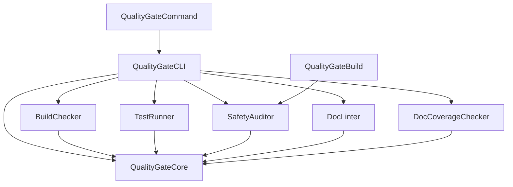

# Design Proposal: quality-gate-swift

**Status:** Pending Approval
**Date:** 2026-03-13
**Author:** AI Assistant

---

## 1. Objective

**Objective:** Create a production-quality Swift CLI tool that automates the Zero Warnings/Errors Gate defined in `04_IMPLEMENTATION_CHECKLIST.md`, replacing the prototype `gate-check.sh` bash script.

**Master Plan Reference:** Operational tooling for development-guidelines repository — supports the Design-First TDD workflow.

**Problem Statement:** The current bash script has limitations:
- No structured output for CI/CD integration
- Limited error reporting and diagnostics
- Not easily extensible with new quality checks
- Cannot be absorbed into Swift Package Manager build process

**Solution:** A modular Swift CLI with plugin-based architecture that:
- Runs all quality checks with structured JSON/SARIF output
- Integrates with SPM as both CommandPlugin and BuildToolPlugin
- Absorbs existing `docc-lint` and `swift-doc-gaps` capabilities
- Supports project-specific configuration via `.quality-gate.yml`

---

## 2. Proposed Architecture

### Repository Structure

```
quality-gate-swift/
├── Package.swift
├── Sources/
│   ├── QualityGateCore/           # Shared protocol and models
│   │   ├── QualityChecker.swift   # Protocol all checkers implement
│   │   ├── CheckResult.swift      # Result model (passed/failed/warnings)
│   │   ├── Diagnostic.swift       # File/line/message model
│   │   ├── Configuration.swift    # YAML config model
│   │   └── Reporters/
│   │       ├── Reporter.swift     # Output protocol
│   │       ├── TerminalReporter.swift
│   │       ├── JSONReporter.swift
│   │       └── SARIFReporter.swift
│   ├── BuildChecker/              # swift build wrapper
│   │   └── BuildChecker.swift
│   ├── TestRunner/                # swift test wrapper
│   │   └── TestRunner.swift
│   ├── SafetyAuditor/             # Forbidden pattern scanner
│   │   └── SafetyAuditor.swift
│   ├── DocLinter/                 # Absorbs docc-lint capabilities
│   │   └── DocLinter.swift
│   ├── DocCoverageChecker/        # Absorbs swift-doc-gaps capabilities
│   │   └── DocCoverageChecker.swift
│   ├── QualityGateCLI/            # Umbrella CLI
│   │   └── main.swift
│   └── Plugins/
│       ├── QualityGateCommand/    # CommandPlugin for `swift package quality-gate`
│       │   └── QualityGateCommand.swift
│       └── QualityGateBuild/      # BuildToolPlugin for automatic checks
│           └── QualityGateBuild.swift
└── Tests/
    ├── QualityGateCoreTests/
    ├── SafetyAuditorTests/
    ├── DocLinterTests/
    └── DocCoverageCheckerTests/
```

### Module Dependency Graph



---

## 3. API Surface

### QualityChecker Protocol (Core Contract)

```swift
// Sources/QualityGateCore/QualityChecker.swift

/// Protocol that all quality checkers must implement.
public protocol QualityChecker: Sendable {
    /// Unique identifier for this checker (e.g., "build", "test", "safety")
    var id: String { get }

    /// Human-readable name for display
    var name: String { get }

    /// Run the quality check and return results
    func check(configuration: Configuration) async throws -> CheckResult
}
```

### CheckResult Model

```swift
// Sources/QualityGateCore/CheckResult.swift

/// Result of a quality check.
public struct CheckResult: Sendable, Codable {
    public let checkerId: String
    public let status: Status
    public let diagnostics: [Diagnostic]
    public let duration: Duration

    public enum Status: String, Sendable, Codable {
        case passed
        case failed
        case warning
        case skipped
    }
}
```

### Diagnostic Model

```swift
// Sources/QualityGateCore/Diagnostic.swift

/// A single diagnostic message from a quality check.
public struct Diagnostic: Sendable, Codable {
    public let severity: Severity
    public let message: String
    public let file: String?
    public let line: Int?
    public let column: Int?
    public let ruleId: String?
    public let suggestedFix: String?

    public enum Severity: String, Sendable, Codable {
        case error
        case warning
        case note
    }
}
```

### Reporter Protocol

```swift
// Sources/QualityGateCore/Reporters/Reporter.swift

/// Protocol for outputting check results.
public protocol Reporter: Sendable {
    func report(_ results: [CheckResult], to output: inout TextOutputStream) throws
}
```

### CLI Interface

```bash
# Full quality gate (all checks)
quality-gate

# With JSON output for CI
quality-gate --format json

# Specific checks only
quality-gate --check build --check test

# With custom config
quality-gate --config .quality-gate.yml

# SARIF output for GitHub Code Scanning
quality-gate --format sarif > results.sarif
```

### SPM Integration

```swift
// In consuming project's Package.swift
dependencies: [
    .package(url: "https://github.com/jpurnell/quality-gate-swift.git", from: "1.0.0")
],
targets: [
    .target(
        name: "MyApp",
        plugins: [
            .plugin(name: "QualityGateBuildPlugin", package: "quality-gate-swift")
        ]
    )
]

// Run via SPM
// swift package quality-gate
```

---

## 4. MCP Schema

**Tool Description:** Run automated quality checks on a Swift project.

**REQUIRED STRUCTURE (JSON):**
```json
{
  "checks": ["build", "test", "safety", "doc-lint", "doc-coverage"],
  "format": "json",
  "config": {
    "parallelWorkers": 8,
    "excludePatterns": ["**/Generated/**"],
    "safetyExemptions": ["// SAFETY:"]
  }
}
```

**Parameter Types:**
- checks (array of strings): List of checkers to run. Valid values: "build", "test", "safety", "doc-lint", "doc-coverage". Default: all.
- format (string): Output format. Valid values: "terminal", "json", "sarif". Default: "terminal".
- config (object): Project-specific configuration.
  - parallelWorkers (integer): Number of test workers. Default: `cores * 0.8`.
  - excludePatterns (array of strings): Glob patterns to exclude from safety audit.
  - safetyExemptions (array of strings): Comment patterns that suppress safety warnings.

---

## 5. Constraints & Compliance

**Concurrency:**
- All types are `Sendable` (required for Swift 6 strict concurrency)
- Checkers run with structured concurrency (`async/await`)
- No actors needed — all models are immutable value types

**Determinism:**
- No stochastic behavior — all checks are deterministic
- Same input always produces same output

**Generics:**
- Not applicable — this is a CLI tool, not a library API

**Safety:**
- No force unwraps (`!`)
- No force casts (`as!`)
- All file operations use `throws`
- Process execution has timeout bounds

**MCP Ready:**
- JSON schema defined above
- All output formats are machine-parseable

---

## 6. Backend Abstraction

**Not applicable.** This tool is not compute-intensive — it orchestrates existing Swift toolchain commands.

---

## 7. Dependencies

### Internal Dependencies

None (standalone tool).

### External Dependencies

| Package | Version | Purpose |
|---------|---------|---------|
| swift-argument-parser | 1.3.0+ | CLI argument parsing |
| Yams | 5.0.0+ | YAML configuration parsing |
| SwiftSyntax | 600.0.0+ | Swift source code parsing for safety audit and doc coverage |

### Error Types

**New Error Registry Entries (to be added to Master Plan):**

| Error Case | Description |
|------------|-------------|
| `QualityGateError.buildFailed` | Swift build exited with non-zero status |
| `QualityGateError.testsFailed` | One or more tests failed |
| `QualityGateError.safetyViolation` | Forbidden pattern detected without exemption |
| `QualityGateError.docLintFailed` | Documentation has errors or warnings |
| `QualityGateError.configurationError` | Invalid YAML configuration |
| `QualityGateError.processTimeout` | External command exceeded timeout |

---

## 8. Test Strategy

### Test Categories

| Category | Examples |
|----------|----------|
| Golden Path | Run all checks on a valid project → all pass |
| Failing Build | Project with compile error → build check fails with diagnostic |
| Failing Tests | Project with test failure → test runner reports specific failure |
| Safety Violations | File with `try!` → safety auditor detects and reports |
| Exemptions Work | File with `try! // SAFETY: justified` → suppressed |
| Doc Lint | Malformed DocC → doc linter reports issue |
| Missing Docs | Public API without `///` → doc coverage reports gap |
| Configuration | Custom YAML → respects all settings |
| Output Formats | Verify JSON and SARIF output structure |

### Reference Truth

- **BuildChecker:** Validates against `swift build` exit codes and stderr parsing
- **TestRunner:** Validates against `swift test --parallel` output
- **SafetyAuditor:** Validated against known patterns in test fixtures
- **DocLinter:** Ported from existing `docc-lint` test suite
- **DocCoverageChecker:** Ported from existing `swift-doc-gaps` test suite

### Validation Trace

```
Test: Safety auditor detects force unwrap
Input: "let x = optional!"
Expected: Diagnostic(severity: .error, message: "Force unwrap", line: 1, ruleId: "force-unwrap")

Test: SARIF output structure
Input: One safety violation
Expected: Valid SARIF 2.1.0 JSON with correct schema
```

---

## 9. Open Questions

All questions resolved in previous conversation:

| Question | Resolution |
|----------|------------|
| Tool name? | `quality-gate-swift` |
| Support YAML config? | Yes, `.quality-gate.yml` |
| Standalone or integrated? | Both — standalone CLI + SPM plugins |
| Absorb existing tools? | Yes — `docc-lint` and `swift-doc-gaps` capabilities |
| Plugin architecture? | Yes — `QualityChecker` protocol with modular checkers |

---

## 10. Documentation Strategy

**Documentation Type:** Narrative Article Required

**Complexity Threshold Check:**
- Does it combine 3+ APIs? **Yes** (5 checker modules + CLI + plugins)
- Does explanation require 50+ lines? **Yes** (installation, configuration, CI integration)
- Does it need theory/background context? **Yes** (quality gates, SARIF format, SPM plugins)

**Article Name:** `QualityGateGuide.md`

**Planned Documentation:**
1. README.md — Installation and quick start
2. QualityGateGuide.md — Full DocC article for narrative documentation
3. API reference — Generated from inline `///` comments

---

## Proposal Review Checklist

### Architecture
- [x] **Module placement** follows standard Swift package structure
- [x] **API design** follows Swift API Design Guidelines
- [x] **Concurrency model** is Swift 6 compliant (Sendable, structured concurrency)
- [x] **No forbidden patterns** in proposed implementation
- [x] **Generics** not applicable (CLI tool)

### MCP Readiness
- [x] **MCP JSON schema** defined with REQUIRED STRUCTURE example
- [x] **All parameter types** mapped to JSON Schema types
- [x] **Nested objects** fully documented

### Testing & Dependencies
- [x] **Test strategy** covers required categories
- [x] **Reference truth** identified (existing tool test suites, Swift toolchain output)
- [x] **Dependencies** are acceptable (all widely-used Swift packages)
- [x] **Open questions** resolved

---

## Implementation Order

Following Design-First TDD, implementation will proceed:

1. **QualityGateCore** — Shared protocol, models, reporters
2. **SafetyAuditor** — Most self-contained, good starting point
3. **BuildChecker** — Wraps `swift build`
4. **TestRunner** — Wraps `swift test`
5. **DocLinter** — Port from `docc-lint`
6. **DocCoverageChecker** — Port from `swift-doc-gaps`
7. **QualityGateCLI** — Orchestrates all checkers
8. **SPM Plugins** — CommandPlugin and BuildToolPlugin
9. **Configuration** — YAML parsing and validation

Each module follows the RED → GREEN → REFACTOR → DOCUMENT cycle.

---

**Awaiting approval to proceed with implementation.**
